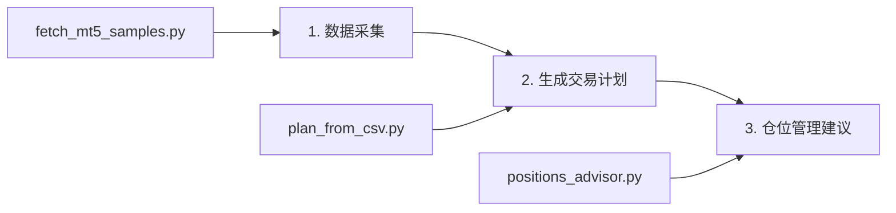

# MT5 交易助手

基于 GPT 和价格行为学的 AI 交易助手，支持从 MT5 获取数据并生成交易计划。

## 功能特性

- 📊 **数据采集**: 支持从 MT5 获取多品种、多时间周期的行情数据
- 🤖 **AI 分析**: 基于 Al Brooks 价格行为学，使用 GPT 生成交易计划
- 📈 **仓位管理**: 结合当前持仓情况，提供仓位管理建议
- 🔄 **工作流集成**: 三个核心脚本串联使用，形成完整的交易分析流程

## 环境配置

### 1. 系统要求

- Python 3.9+
- MetaTrader 5 终端（已安装并登录）
- OpenAI API 密钥或兼容的 API 服务

### 2. 安装依赖

```bash
# 克隆项目
git clone <repository-url>
cd mt5-trading-assistant

# 创建虚拟环境
python -m venv venv

# 激活虚拟环境
# Windows:
venv\Scripts\activate
# Linux/Mac:
source venv/bin/activate

# 安装依赖
pip install -r requirements.txt
```

### 3. 环境变量配置

创建 `.env` 文件在项目根目录：

```env
# OpenAI API 配置
OPENAI_API_KEY=your_openai_api_key_here
OPENAI_BASE_URL=https://api.openai.com/v1  # 可选，默认使用 OpenAI 官方 API
OPENAI_MODEL=gpt-4o-mini  # 可选，默认模型

# MT5 终端路径（可选，如果 MT5 不在默认位置）
MT5_TERMINAL=C:\Program Files\MetaTrader 5\terminal64.exe
```

### 4. MT5 配置

确保：
- MetaTrader 5 已安装并正常运行
- 已登录交易账户
- 确保要分析的交易品种在 MT5 中可用（如 XAUUSDm、BTCUSDm、ETHUSDm）

## 使用方法

项目包含三个核心脚本，可以串联使用形成完整的交易分析工作流：

### 工作流程



### 1. 数据采集 (`scripts/fetch_mt5_samples.py`)

从 MT5 获取历史行情数据并保存为 CSV 文件。

```bash
python scripts/fetch_mt5_samples.py
```

**功能**：
- 自动获取 XAUUSDm、BTCUSDm、ETHUSDm 三个品种的数据
- 支持 D1（100根）、H1（100根）、M5（300根）三个时间周期
- 数据保存到 `output/` 目录

**输出示例**：
```
output/
├── XAUUSDm_D1_100.csv
├── XAUUSDm_H1_100.csv
├── XAUUSDm_M5_300.csv
├── BTCUSDm_D1_100.csv
├── BTCUSDm_H1_100.csv
├── BTCUSDm_M5_300.csv
├── ETHUSDm_D1_100.csv
├── ETHUSDm_H1_100.csv
└── ETHUSDm_M5_300.csv
```

### 2. 生成交易计划 (`scripts/plan_from_csv.py`)

基于 CSV 数据使用 GPT 生成交易计划。

```bash
# 使用默认配置（BTCUSDm, M5, 300根K线）
python scripts/plan_from_csv.py

# 指定交易品种和时间周期
python scripts/plan_from_csv.py --symbol XAUUSDm,M5,300
```

**参数说明**：
- `--symbol`: 交易对参数，格式为 `SYMBOL[,TIMEFRAME[,ROWS]]`
  - `XAUUSDm`: 仅指定品种，使用默认 M5 和 300 根K线
  - `XAUUSDm,M5`: 指定品种和时间周期，使用默认 300 根K线
  - `XAUUSDm,M5,300`: 完整指定所有参数

**功能**：
- 读取 CSV 数据并构建分析提示
- 调用 OpenAI API 生成基于 Al Brooks 价格行为学的交易计划
- 保存交易计划到 `output/plans/` 目录
- 保存对话记录到 `output/conversations/` 目录

**输出示例**：
```
output/
├── plans/
│   └── plan_XAUUSDm_20250118_143022.md
└── conversations/
    └── conv_XAUUSDm_20250118_143022.json
```

### 3. 仓位管理建议 (`scripts/positions_advisor.py`)

结合当前持仓情况，提供仓位管理建议。

```bash
# 使用最新的交易计划对话
python scripts/positions_advisor.py --symbol XAUUSDm

# 指定具体的对话文件
python scripts/positions_advisor.py --conversation output/conversations/conv_XAUUSDm_20250118_143022.json

# 从计划文件推导对话文件
python scripts/positions_advisor.py --plan output/plans/plan_XAUUSDm_20250118_143022.md
```

**参数说明**：
- `--symbol`: 交易品种，自动匹配最新的对话文件
- `--conversation`: 指定对话 JSON 文件路径
- `--plan`: 指定计划 Markdown 文件路径，自动推导对应的对话文件
- `--terminal`: MT5 终端路径（可选）
- `--output`: 保存建议为 JSON 文件（可选）
- `--md_output`: 保存建议为 Markdown 文件（可选）

**功能**：
- 从 MT5 读取当前持仓信息
- 结合之前的交易计划分析
- 生成仓位管理和风险控制建议
- 保存建议到 `output/advices/` 目录

**输出示例**：
```
output/
└── advices/
    └── advice_XAUUSDm_20250118_143156.md
```

## 完整使用示例

### 场景：分析黄金（XAUUSDm）交易机会

```bash
# 1. 获取最新行情数据
python scripts/fetch_mt5_samples.py

# 2. 生成交易计划
python scripts/plan_from_csv.py --symbol XAUUSDm,M5,300

# 3. 获取仓位管理建议
python scripts/positions_advisor.py --symbol XAUUSDm
```

### 场景：分析比特币（BTCUSDm）并指定 MT5 路径

```bash
# 1. 获取数据
python scripts/fetch_mt5_samples.py

# 2. 生成计划
python scripts/plan_from_csv.py --symbol BTCUSDm,H1,100

# 3. 获取建议（指定 MT5 路径）
python scripts/positions_advisor.py --symbol BTCUSDm --terminal "C:\Program Files\MetaTrader 5\terminal64.exe"
```

## 输出文件说明

### 交易计划文件 (`output/plans/plan_*.md`)
包含 AI 生成的交易计划，包括：
- 市场分析
- 交易策略
- 入场条件
- 止损止盈设置
- 风险管理建议

### 对话记录文件 (`output/conversations/conv_*.json`)
保存完整的对话历史，包括：
- 用户输入的市场数据
- AI 的交易计划回复
- 可用于后续的仓位管理分析

### 仓位建议文件 (`output/advices/advice_*.md`)
包含：
- 当前持仓情况
- 基于交易计划的仓位管理建议
- 风险控制措施

## 故障排除

### 常见问题

1. **MT5 连接失败**
   ```
   RuntimeError: MT5初始化失败
   ```
   - 确保 MT5 已安装并登录
   - 检查 `MT5_TERMINAL` 环境变量或 `--terminal` 参数
   - 确认 MT5 终端路径正确

2. **OpenAI API 调用失败**
   ```
   RuntimeError: 未安装 openai 包
   ```
   - 检查 `OPENAI_API_KEY` 环境变量
   - 确认网络连接正常
   - 验证 API 密钥有效性

3. **CSV 文件不存在**
   ```
   FileNotFoundError: CSV 不存在
   ```
   - 先运行 `fetch_mt5_samples.py` 获取数据
   - 检查 `output/` 目录是否存在相应文件

4. **持仓读取失败**
   ```
   RuntimeError: 读取持仓失败
   ```
   - 确保 MT5 账户已登录
   - 检查交易品种代码是否正确
   - 确认账户中有持仓数据

## 开发说明

### 项目结构
```
mt5-trading-assistant/
├── src/                    # 核心模块
│   ├── MT5DataProvider.py # MT5 数据接口
│   └── OpenAIClient.py    # OpenAI API 客户端
├── scripts/               # 可执行脚本
│   ├── fetch_mt5_samples.py
│   ├── plan_from_csv.py
│   └── positions_advisor.py
├── output/                # 输出目录
│   ├── plans/            # 交易计划
│   ├── conversations/    # 对话记录
│   └── advices/          # 仓位建议
├── docs/                  # 文档
└── requirements.txt       # 依赖列表
```

### 扩展开发

- 添加新的交易品种：修改 `fetch_mt5_samples.py` 中的 `symbols` 列表
- 调整时间周期：修改 `timeframe_to_count` 字典
- 自定义 AI 提示：编辑 `plan_from_csv.py` 中的 `make_prompt_merged` 函数
- 添加新的分析功能：扩展 `MT5DataProvider.py` 类

## 许可证

本项目仅供学习和研究使用，不构成投资建议。使用本工具进行实际交易的风险由用户自行承担。
